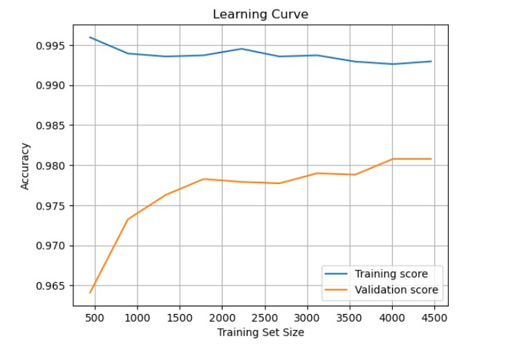

# Multinomial Naive Bayes SMS Spam Classifier (Scratch)

This project implements a **Multinomial Naive Bayes** classifier from scratch (no scikit-learn NaiveBayes).  
It classifies SMS messages as spam or ham, using the classic **SMS Spam Collection** dataset.

## Project Presentation
-- https://www.youtube.com/......

## Structure
- `src/` – source code
- `data/` – dataset
- `results/` – generated plots
- `notebooks/` – optional interactive demo

## Features
- Manual tokenization and word frequency calculation
- Laplace smoothing to handle zero probabilities
- Evaluation: accuracy, precision, recall, F1-score
- Visualizations: ROC curve, learning curve, confidence interval

## Results & Visualizations
| Confusion Matrix                          | ROC Curve                              |
|------------------------------------------|---------------------------------------|
|  |   |

| Learning Curve                            | Confidence Interval                    |
|------------------------------------------|---------------------------------------|
|  |  |

| Performance Metrics                       |                                        |
|------------------------------------------|---------------------------------------|
|  |                    

## Setup and Requirements
This project was developed using **Anaconda** and **Jupyter Notebook**.  
Below are the recommended setup steps:

### Using Anaconda
```bash
conda create -n sms-spam python=3.10
conda activate sms-spam
conda install jupyter pandas numpy scikit-learn matplotlib statsmodels

### Using pip
pip install pandas numpy scikit-learn matplotlib statsmodels

### Running the Project as Jupyter Notebook
```bash
jupyter notebook

### Running as Python Script
If you prefer not to use Jupyter Notebook, you can also run the project as a standalone Python script:
```bash
python src/main.py

> This project was submitted for the Data Mining course in the Spring Semester 2024–2025 at Bursa Technical University.


